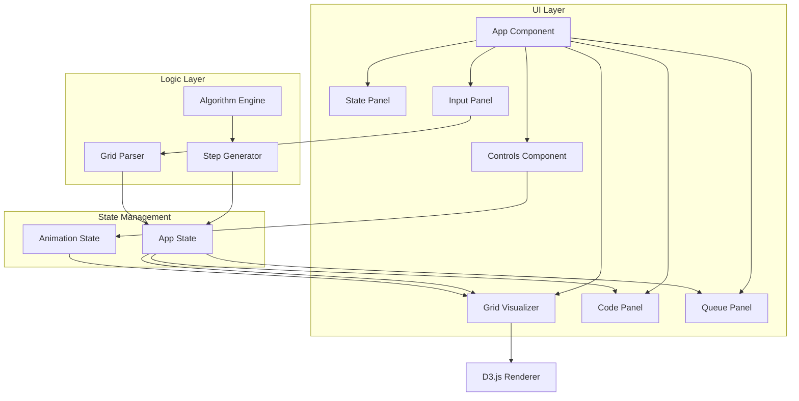

# Design Document

## Overview

本项目是一个腐烂橘子算法（LeetCode 994）的可视化演示应用。使用 TypeScript + React + D3.js 技术栈，通过分步骤动画展示 BFS 算法如何模拟橘子腐烂的传播过程。应用运行在端口 40889，采用单屏幕响应式设计，部署在 GitHub Pages 上。

核心功能包括：
- 网格可视化渲染（D3.js）
- BFS 算法步骤生成
- Java 代码展示与语法高亮
- 类 IDE 调试效果（高亮执行行、变量值内联展示）
- BFS 队列状态可视化
- 动画播放控制（支持键盘快捷键）
- 自定义网格输入
- 实时状态显示
- GitHub Actions 自动部署

## Architecture



## Layout Design

```
+------------------------------------------------------------------+
|  [LeetCode Icon] 994. 腐烂的橘子              [GitHub Icon]       |
+------------------+----------------------------+-------------------+
|                  |                            |                   |
|   Code Panel     |      Grid Visualizer       |   State Panel     |
|   (Java Code     |      (D3.js SVG)           |   (Stats)         |
|   with syntax    |                            |                   |
|   highlighting   |                            +-------------------+
|   + debug mode)  |                            |                   |
|                  |                            |   Queue Panel     |
|   fresh = 4      |                            |   (BFS Queue)     |
|   queue.size = 2 |                            |                   |
+------------------+----------------------------+-------------------+
|                         Controls                                  |
|   [← Prev] [→ Next] [Space Play/Pause] [Reset]  Speed: [===o===] |
+------------------------------------------------------------------+
|                       Input Panel                                 |
|   [Example 1] [Example 2] [Example 3]  [Custom Input...]         |
+------------------------------------------------------------------+
```

## Components and Interfaces

### 0. Header Component (`src/components/Header.tsx`)

```typescript
interface HeaderProps {
  githubUrl: string;  // GitHub 仓库地址
}

// Header 组件
// - 左侧显示 LeetCode 图标和题目标题 "994. 腐烂的橘子"
// - 标题可点击，跳转到 LeetCode 题目页面
// - 右侧显示 GitHub 图标，点击在新标签页打开仓库
// - 悬停时有视觉反馈（颜色变化、下划线等）

const LEETCODE_URL = 'https://leetcode.cn/problems/rotting-oranges/';
```

### 1. Algorithm Engine (`src/algorithm/rottingOranges.ts`)

```typescript
interface Cell {
  row: number;
  col: number;
  state: CellState;
}

enum CellState {
  EMPTY = 0,
  FRESH = 1,
  ROTTEN = 2,
}

interface GridState {
  grid: CellState[][];
  minute: number;
  freshCount: number;
  rottenCount: number;
  newlyRotten: Cell[]; // 本轮新腐烂的橘子，用于高亮
}

interface AlgorithmResult {
  steps: GridState[];
  finalMinutes: number; // -1 表示不可能
  success: boolean;
}

// 核心算法函数
function generateSteps(initialGrid: CellState[][]): AlgorithmResult;
function getAdjacentFresh(grid: CellState[][], row: number, col: number): Cell[];
```

### 2. Grid Visualizer (`src/components/GridVisualizer.tsx`)

```typescript
interface CellInfo {
  row: number;
  col: number;
  state: CellState;
  infectionTime?: number;  // 被感染的时间（分钟数），仅对腐烂橘子有效
  isProcessing?: boolean;  // 当前是否正在被处理
}

interface GridVisualizerProps {
  gridState: GridState;
  cellSize?: number;
  animationDuration?: number;
  showCoordinates?: boolean;      // 是否显示坐标
  showInfectionTime?: boolean;    // 是否显示感染时间
  currentProcessingCell?: Cell;   // 当前正在处理的单元格
  checkingDirection?: Direction;  // 当前检查的方向
}

type Direction = 'up' | 'down' | 'left' | 'right' | null;

// D3.js 渲染逻辑
// - 使用 SVG 绘制网格
// - 根据 CellState 设置颜色
// - 对 newlyRotten 单元格添加过渡动画
// - 在单元格内显示坐标 (row, col)
// - 对腐烂橘子显示感染时间
// - 对正在处理的单元格添加高亮边框/发光效果
// - 显示方向指示器指向正在检查的相邻单元格
```

### 3. Controls Component (`src/components/Controls.tsx`)

```typescript
interface ControlsProps {
  isPlaying: boolean;
  currentStep: number;
  totalSteps: number;
  onPlay: () => void;
  onPause: () => void;
  onNext: () => void;
  onPrev: () => void;
  onReset: () => void;
  playbackSpeed: number;
  onSpeedChange: (speed: number) => void;
}

// 键盘快捷键映射
const KEYBOARD_SHORTCUTS = {
  ArrowLeft: 'onPrev',    // 左方向键 -> 上一步
  ArrowRight: 'onNext',   // 右方向键 -> 下一步
  Space: 'togglePlay',    // 空格键 -> 播放/暂停
} as const;

// 按钮显示文案（包含快捷键提示）
const BUTTON_LABELS = {
  prev: '← 上一步',
  next: '下一步 →',
  play: '▶ 播放 (Space)',
  pause: '⏸ 暂停 (Space)',
  reset: '⟲ 重置',
} as const;

// 使用 useEffect 监听全局键盘事件
// 按下快捷键时触发对应按钮的视觉反馈（如按钮高亮）
```

### 4. State Panel (`src/components/StatePanel.tsx`)

```typescript
interface StatePanelProps {
  minute: number;
  freshCount: number;
  rottenCount: number;
  emptyCount: number;           // 空单元格数量
  totalCells: number;           // 总单元格数量
  infectedThisMinute: number;   // 本分钟感染的橘子数
  bfsWave: number;              // 当前 BFS 波次/层级
  isComplete: boolean;
  result: number;               // 最终结果
}

// 显示内容：
// - 当前分钟数 / BFS 波次
// - 单元格统计：总数 | 空 | 新鲜 | 腐烂
// - 感染进度：百分比进度条
// - 本轮感染数量
// - 最终结果（完成时显示）
```

### 5. Input Panel (`src/components/InputPanel.tsx`)

```typescript
interface InputPanelProps {
  onGridChange: (grid: CellState[][]) => void;
  presets: PresetExample[];
}

interface PresetExample {
  name: string;
  grid: CellState[][];
  expectedResult: number;
}
```

### 6. Grid Parser (`src/utils/gridParser.ts`)

```typescript
// 解析用户输入的网格字符串
function parseGrid(input: string): CellState[][] | null;

// 序列化网格为字符串
function serializeGrid(grid: CellState[][]): string;

// 验证网格是否有效
function validateGrid(grid: CellState[][]): ValidationResult;

interface ValidationResult {
  valid: boolean;
  error?: string;
}
```

### 7. Code Panel (`src/components/CodePanel.tsx`)

```typescript
interface VariableValue {
  name: string;       // 变量名
  value: string;      // 变量值（字符串表示）
  line: number;       // 变量所在行号
}

interface CodePanelProps {
  highlightedLines: number[];  // 当前高亮的代码行号
  currentPhase: AlgorithmPhase;
  variables: VariableValue[];  // 当前步骤的变量值
}

enum AlgorithmPhase {
  INIT = 'init',           // 初始化阶段：统计新鲜橘子，腐烂橘子入队
  BFS_LOOP = 'bfs_loop',   // BFS 主循环
  CHECK_ADJACENT = 'check_adjacent',  // 检查相邻单元格
  INFECT = 'infect',       // 感染新鲜橘子
  COMPLETE = 'complete',   // 算法完成
}

// 变量行号映射（变量在代码中首次出现/更新的行号）
const VARIABLE_LINE_MAP = {
  fresh: 7,           // int fresh = 0;
  queueSize: 6,       // Queue<int[]> queue
  r: 27,              // int r = cell[0]
  c: 27,              // int c = cell[1]
  nr: 32,             // int nr = r + dir[0]
  nc: 33,             // int nc = c + dir[1]
  minutes: 20,        // int minutes = 0;
} as const;

// 语法高亮使用 Prism.js 或自定义 CSS 类
// - 关键字: class, public, int, if, else, for, while, return
// - 类型: int, Queue, LinkedList
// - 字符串/数字: 常量值
// - 注释: // 开头的行

// 调试效果实现：
// 1. 高亮当前执行行：使用背景色标记 highlightedLines 中的行
// 2. 变量值内联展示：在对应行末尾添加 "// variable = value" 样式的标注
// 3. 变量值变化动画：使用 CSS transition 或 framer-motion 实现淡入效果

// Java 代码常量（带行号注释便于映射）
const JAVA_CODE = `
class Solution {                                           // 1
    public int orangesRotting(int[][] grid) {              // 2
        int M = grid.length;                               // 3
        int N = grid[0].length;                            // 4
        Queue<int[]> queue = new LinkedList<>();           // 5
        int fresh = 0;                                     // 6
                                                           // 7
        // 初始化：统计新鲜橘子，腐烂橘子入队               // 8
        for (int r = 0; r < M; r++) {                      // 9
            for (int c = 0; c < N; c++) {                  // 10
                if (grid[r][c] == 1) {                     // 11
                    fresh++;                               // 12
                } else if (grid[r][c] == 2) {              // 13
                    queue.add(new int[]{r, c});            // 14
                }                                          // 15
            }                                              // 16
        }                                                  // 17
                                                           // 18
        int minutes = 0;                                   // 19
        int[][] dirs = {{-1, 0}, {1, 0}, {0, -1}, {0, 1}}; // 20
                                                           // 21
        // BFS 主循环                                       // 22
        while (!queue.isEmpty() && fresh > 0) {            // 23
            int size = queue.size();                       // 24
            for (int i = 0; i < size; i++) {               // 25
                int[] cell = queue.poll();                 // 26
                int r = cell[0], c = cell[1];              // 27
                                                           // 28
                // 检查四个方向的相邻单元格                  // 29
                for (int[] dir : dirs) {                   // 30
                    int nr = r + dir[0];                   // 31
                    int nc = c + dir[1];                   // 32
                                                           // 33
                    if (nr >= 0 && nr < M && nc >= 0 && nc < N  // 34
                        && grid[nr][nc] == 1) {            // 35
                        grid[nr][nc] = 2;                  // 36
                        fresh--;                           // 37
                        queue.add(new int[]{nr, nc});      // 38
                    }                                      // 39
                }                                          // 40
            }                                              // 41
            minutes++;                                     // 42
        }                                                  // 43
                                                           // 44
        return fresh == 0 ? minutes : -1;                  // 45
    }                                                      // 46
}                                                          // 47
`;
```

### 8. Queue Panel (`src/components/QueuePanel.tsx`)

```typescript
interface QueuePanelProps {
  queue: Cell[];           // 当前队列中的单元格
  recentlyAdded: Cell[];   // 最近添加的单元格（用于动画）
  recentlyRemoved: Cell[]; // 最近移除的单元格（用于动画）
  currentProcessingIndex?: number;  // 当前正在处理的元素索引
  queueCapacity?: number;  // 队列最大容量（用于显示）
}

// 显示内容：
// - 队列大小：当前数量 / 最大容量
// - 队列元素列表，每个元素显示坐标 (row, col)
// - 队首元素（正在出队）高亮显示
// - 新入队元素用不同颜色标记
// - 空队列时显示 "队列为空" 指示器
```

## Data Models

### Grid State Model

```typescript
interface VariableValue {
  name: string;       // 变量名
  value: string;      // 变量值（字符串表示）
  line: number;       // 变量所在行号
}

interface CellWithInfo {
  row: number;
  col: number;
  state: CellState;
  infectionTime?: number;  // 被感染的时间（分钟数）
}

interface GridState {
  grid: CellState[][];      // 当前网格状态
  cellInfoGrid: CellWithInfo[][]; // 带详细信息的网格
  minute: number;           // 当前分钟数
  freshCount: number;       // 剩余新鲜橘子数
  rottenCount: number;      // 腐烂橘子数
  emptyCount: number;       // 空单元格数量
  totalCells: number;       // 总单元格数量
  infectedThisMinute: number; // 本分钟感染的橘子数
  bfsWave: number;          // 当前 BFS 波次/层级
  newlyRotten: Cell[];      // 本步骤新腐烂的橘子
  queue: Cell[];            // 当前 BFS 队列状态
  highlightedLines: number[]; // 当前高亮的代码行
  phase: AlgorithmPhase;    // 当前算法阶段
  variables: VariableValue[]; // 当前步骤的变量值（用于调试展示）
  currentCell?: Cell;       // 当前正在处理的单元格（r, c）
  checkingDirection?: 'up' | 'down' | 'left' | 'right'; // 当前检查的方向
}
```

### Animation State Model

```typescript
interface AnimationState {
  isPlaying: boolean;
  currentStepIndex: number;
  playbackSpeed: number;    // 毫秒/步
}
```

### App State Model

```typescript
interface AppState {
  initialGrid: CellState[][];
  algorithmResult: AlgorithmResult;
  animationState: AnimationState;
}
```

## Correctness Properties

*A property is a characteristic or behavior that should hold true across all valid executions of a system-essentially, a formal statement about what the system should do. Properties serve as the bridge between human-readable specifications and machine-verifiable correctness guarantees.*

### Property 1: Cell Rendering Consistency

*For any* valid grid and *for any* cell in that grid, the rendering function SHALL produce visual attributes (color, indicator) that correctly correspond to the cell's state (0=empty/gray, 1=fresh/orange, 2=rotten/brown).

**Validates: Requirements 1.2, 1.3, 1.4**

### Property 2: Step Navigation Forward

*For any* animation state where currentStepIndex < totalSteps - 1, advancing to the next step SHALL increment currentStepIndex by exactly 1.

**Validates: Requirements 2.3**

### Property 3: Step Navigation Backward

*For any* animation state where currentStepIndex > 0, going to the previous step SHALL decrement currentStepIndex by exactly 1.

**Validates: Requirements 2.4**

### Property 4: Reset Returns to Initial State

*For any* animation state, resetting SHALL set currentStepIndex to 0 and restore the grid to its initial configuration.

**Validates: Requirements 2.5**

### Property 5: BFS Adjacent Cell Identification

*For any* grid state and *for any* rotten orange cell, the algorithm SHALL correctly identify all adjacent (4-directional) fresh oranges as candidates for the next infection round.

**Validates: Requirements 3.1**

### Property 6: Algorithm Result Correctness

*For any* valid initial grid, the algorithm SHALL produce the correct final result: the minimum minutes to rot all oranges, or -1 if some fresh oranges are unreachable.

**Validates: Requirements 3.4**

### Property 7: Grid Parsing Round Trip

*For any* valid grid, serializing the grid to a string and then parsing it back SHALL produce an equivalent grid.

**Validates: Requirements 4.1**

### Property 8: Invalid Input Rejection

*For any* string that does not conform to the valid grid format (invalid characters, inconsistent row lengths, values outside 0-2), the parser SHALL reject it and return an error.

**Validates: Requirements 4.2**

### Property 9: State Display Consistency

*For any* grid state at step N, the displayed minute count SHALL equal the step's minute value, the displayed fresh count SHALL equal the actual count of cells with value 1, and the displayed rotten count SHALL equal the actual count of cells with value 2.

**Validates: Requirements 5.1, 5.2, 5.3, 5.4**

### Property 10: Code Highlight Consistency

*For any* algorithm step, the highlighted code lines SHALL correspond to the current algorithm phase (initialization, BFS loop, adjacent check, infection, or completion).

**Validates: Requirements 7.2, 7.3, 7.4, 7.5**

### Property 11: Queue State Consistency

*For any* algorithm step, the displayed queue contents SHALL match the actual BFS queue state at that step, containing exactly the rotten oranges waiting to be processed.

**Validates: Requirements 8.1**

### Property 12: Variable Display Consistency

*For any* algorithm step, the displayed variable values (fresh, queue size, r, c, minutes) SHALL match the actual algorithm state at that step. Variables that are in scope at the current phase SHALL be displayed with their correct values.

**Validates: Requirements 11.2, 11.3, 11.5**

### Property 13: Keyboard Shortcut Consistency

*For any* animation state, pressing a keyboard shortcut SHALL trigger the same state change as clicking the corresponding button:
- Left Arrow → same effect as clicking "Previous" button
- Right Arrow → same effect as clicking "Next" button  
- Space → same effect as clicking "Play/Pause" button

**Validates: Requirements 12.1, 12.2, 12.3**

### Property 14: Cell Info Display Consistency

*For any* grid state and *for any* cell in that grid:
- The displayed coordinate SHALL match the cell's actual (row, col) position
- For rotten oranges that were infected during the algorithm, the displayed infection time SHALL match the minute when the cell became rotten

**Validates: Requirements 14.1, 14.2**

### Property 15: Enhanced Statistics Consistency

*For any* grid state at step N:
- The infection progress percentage SHALL equal (initialFreshCount - currentFreshCount) / initialFreshCount * 100
- The infectedThisMinute count SHALL equal the number of cells that became rotten in the current minute
- The BFS wave number SHALL equal the current minute number

**Validates: Requirements 15.2, 15.3, 15.4**

## CI/CD Configuration

### GitHub Actions Workflow (`.github/workflows/deploy.yml`)

```yaml
name: Deploy to GitHub Pages

on:
  push:
    branches: [main]

permissions:
  contents: read
  pages: write
  id-token: write

concurrency:
  group: "pages"
  cancel-in-progress: false

jobs:
  build:
    runs-on: ubuntu-latest
    steps:
      - uses: actions/checkout@v4
      - uses: actions/setup-node@v4
        with:
          node-version: '20'
          cache: 'npm'
      - run: npm ci
      - run: npm run build
      - uses: actions/upload-pages-artifact@v3
        with:
          path: ./dist

  deploy:
    environment:
      name: github-pages
      url: ${{ steps.deployment.outputs.page_url }}
    runs-on: ubuntu-latest
    needs: build
    steps:
      - uses: actions/deploy-pages@v4
        id: deployment
```

### Vite Configuration for GitHub Pages

```typescript
// vite.config.ts
export default defineConfig({
  base: '/<repository-name>/',  // 设置为仓库名
  // ... 其他配置
});
```

## Error Handling

### Input Validation Errors

- **Invalid Grid Format**: 当用户输入的网格格式不正确时，显示具体错误信息（如"行长度不一致"、"包含无效字符"）
- **Empty Grid**: 空网格输入时提示用户输入有效网格
- **Out of Range Values**: 单元格值不在 0-2 范围内时提示错误

### Runtime Errors

- **Animation State Errors**: 防止步骤索引越界，在边界处禁用相应按钮
- **Rendering Errors**: D3.js 渲染失败时显示降级 UI

## Testing Strategy

### Unit Testing (Vitest)

使用 Vitest 进行单元测试：

1. **Algorithm Engine Tests**
   - 测试 `generateSteps` 函数对各种网格配置的正确性
   - 测试边界情况：空网格、全腐烂、全新鲜、无法到达的橘子

2. **Grid Parser Tests**
   - 测试有效输入的解析
   - 测试无效输入的错误处理

3. **State Management Tests**
   - 测试步骤导航逻辑
   - 测试重置功能

### Property-Based Testing (fast-check)

使用 fast-check 库进行属性测试：

1. **Property 1**: 生成随机有效网格，验证每个单元格的渲染属性与状态匹配
2. **Property 5**: 生成随机网格状态，验证 BFS 相邻单元格识别的正确性
3. **Property 6**: 生成随机网格，验证算法结果与暴力解法一致
4. **Property 7**: 生成随机有效网格，验证序列化-解析往返一致性
5. **Property 8**: 生成随机无效字符串，验证解析器正确拒绝
6. **Property 12**: 生成随机算法步骤，验证变量值展示与实际算法状态一致
7. **Property 13**: 生成随机动画状态，验证键盘快捷键触发的状态变化与按钮点击一致

### Testing Configuration

- 属性测试每个属性运行至少 100 次迭代
- 每个属性测试必须标注对应的设计文档属性编号
- 格式：`**Feature: rotting-oranges-visualizer, Property {number}: {property_text}**`

### Unit Testing for New Features

1. **Header Component Tests**
   - 验证标题文本为 "994. 腐烂的橘子"
   - 验证标题链接指向 LeetCode 题目页面
   - 验证 GitHub 图标存在且链接正确

2. **Keyboard Shortcut Tests**
   - 验证 Left Arrow 触发上一步
   - 验证 Right Arrow 触发下一步
   - 验证 Space 切换播放/暂停状态
   - 验证按钮显示快捷键提示文案

3. **Variable Display Tests**
   - 验证变量值在正确的代码行后展示
   - 验证变量值与算法状态同步更新
